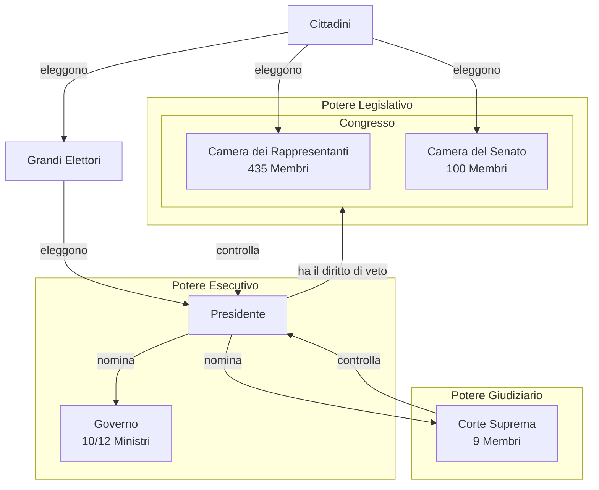

# La Situazione geopolitica Americana
I Padri Pellegrini arrivati dall'Inghilterra dopo alle [[La situazione inglese|persecuzioni]] approdarono in America ed ottennero terreni con autorizzazioni reali o regali dal re. Questi territori vennero presi durante la [[La situazione generale del 700#La guerra dei Sette Anni|guerra dei sette anni]] sottraendoli alla Francia. I coloni avevano rapporti con la madrepatria e portavano la loro cultura ma avevano idee più democratiche e seguivano la religione Puritana, ciò li spinse a creare un'economia nel territorio molto forte.

Nel **1773** con la *Pace di Versailles* la fascia costiera est dell'america venne annessa all'Inghilterra fino alla catena dei Monti Appalachi, dopo ai quali si sarebbero potuti stabilire i Francesi, gli Spagnoli ed i Nativi americani che si sarebbero dovuti spostare dalla zona costiera.

Le colonie iniziali sono 13 e sono divise in tre fasce:
- Territori del Nord (New Hampshire, Rhode Island, Connecticut, Massachusetts)
	  Insediate da più tempo, hanno clima e territori ostili grazie al clima rigido e freddo e le dense foreste che ricoprivano le montagne. Il popolo del Nord è principalmente Puritano e sfruttano il legname e la caccia per il commercio di pelli. Vi erano certe città con l'alta borghesia e piccoli appezzamenti di terreno.
- Territori Centrali (New York, Pennsylvania, New Jersey, Delaware)
	  Il popolo qua è vario e vi sono altri popoli oltre a quello britannico. Il terreno ed il clima sono più miti e ospitali. Vi sono molte città piene di mercanti con grandi porti per il commercio.
- Territori del Sud (Georgia, South Carolina, North Carolina, Virginia, Maryland)
	  Vi sono in questi territori enormi latifondi posseduti da Inglesi che già erano grandi proprietari terrieri in madrepatria. Sfruttano molto gli schiavi su questi terreni e sono di religione Anglicana.
Sono stati suddivisi in tre territori per le differenze territoriali nel clima e paesaggio e per i coloni che le occupavano.
# La situazione politica pre-rivoluzione
Le colonie Inglesi erano considerati territori del Re, quindi il Parlamento Britannico non aveva alcun potere su di esse. Il re non aveva però controllo completo sui territori dato che i proprietari terrieri nominavano dei governatori e ministri che gestivano il territorio. Oltre a questo vi erano pure delle assemblee pseudo parlamentari eletti dagli uomini che pagavano le tasse. Le colonie abitate da più persone avevano il governatore eletto dal Re ed il parlamento eletto dal popolo locale. Per questo c'era separazione tra i poteri legislativi delle colonie e della madrepatria.

Dopo alla [[La situazione generale del 700#La guerra dei Sette Anni|guerra dei sette anni]] la madrepatria aveva bisogno di risorse e denaro. L'Inghilterra quindi per ottenere queste risorse emanò atti come *l'atto di navigazione* per obbligare le colonie a commerciare con la madrepatria e limitando quali risorse potevano produrre per evitare la competizione con la madrepatria. Queste decisioni vennero prese dai *Tories* che dominavano nel parlamento britannico (erano protezionisti al contrario dei Whigs). Questo fece nascere il mercato nero nelle colonie per commerciare i beni proibiti.

I coloni, specialmente coloro che lottarono nella [[La situazione generale del 700#La guerra dei Sette Anni|guerra dei sette anni]] pretendevano più autonomia dato che anche loro dovettero combattere questa guerra per la madrepatria. Il parlamento inglese però spinse per rendere i coloni dei sudditi della corona data l'importanza per l'economia britannica del commercio tra madrepatria e colonie.

I Tories emanarono più leggi per vincolare l'america:
- Divieto di espansione oltre ai Monti Appalachi (1763)
- Invio dell'esercito britannico nelle colonie
	  Questa decisione venne presa perché avrebbe consentito al parlamento di imporre tasse per mantenere l'esercito nelle colonie
- La **tassa sul Bollo**
	  Una specie di IVA, imposta su tutti gli atti di vendita (proprietà e beni), cosa che fece infuriare le colonie che reagirono malamente dato che questa era una forma di protezionismo limitante sui commerci.
Le colonie non accettavano queste leggi dato che venivano imposte da un parlamento dentro al quale non avevano alcuna rappresentanza. Coniarono quindi uno slogan:
**No Taxation without Representation**

# La scintilla della rivoluzione
Dopo alle leggi dei Tories gli americani iniziarono a boicottare le merci britanniche e smisero di pagare la tassa sul bollo per mandare un forte segnale all'Inghilterra. La madrepatria ritirò questa tassa ma mantenne delle tasse su dei prodotti di lusso o specifici.
## Il Massacro di Boston
Nel **1770** a Boston scoppiarono rivolte che venne fermata solo dopo all'omicidio di 5 coloni. Questa rivolta accese la scintilla della rivoluzione. L'Inghilterra, capendo che le colonie si sarebbero potute ribellare con una guerra, decise di rimuovere tutte le tasse apparte quella sul te.
## Il *Boston Tea Party*
Nel **1773** la *Compagnia delle Indie Orientali* stava fallendo, il Re per salvarla dato che questa era una compagnia pubblica, diede ad essa il Monopolio sul Commercio del Te. I coloni, infuriati, occuparono una nave della compagnia nel Porto di Boston e gettarono il Te nel mare, dando il via alla rivoluzione, anche se fino al **1776** non sarebbe scoppiata una vera guerra tra colonie e madrepatria.
## Il congresso di Philadelphia
Nel **1774** si radunò un congresso formato dai rappresentanti delle colonie a Philadelphia dove scrissero una lettera al Re *Giorgio III di Hannover* chiedendo l'indipendenza dal parlamento Inglese. Il Re rifiutò e rispose mandando ulteriori truppe nelle colonie.

Un'anno dopo i Coloni in risposta organizzarono un'esercito di volontari guidato da **George Washington**. Inizialmente questo esercito stava perdendo fino alla **Battaglia di Lexington**.

Venne istituito un secondo congresso dove resero l'esercito improvvisato in un'esercito nazionale stabile con l'aiuto di Francia e Spagna, iniziando la vera guerra d'Indipendenza nel **1776**. Durante a questo congresso venne anche scritta da *Thomas Jefferson* la **Dichiarazione d'Indipendenza** dichiarando l'uguaglianza di tutti gli uomini ed il loro diritto di ribellarsi se questi diritti fossero stati rimossi da loro e venne dichiarato che **la sovranità sarebbe stata del Popolo**.

Nel **1777** con la battaglia di Saratoga gli Americani vinsero e continuarono a vincere fino alla **Battaglia di Yorktown** del **1783** con la resa degli Inglesi stremati dagli alti costi della guerra. Due anni dopo nel **1785** venne firmata la **Pace di Parigi** con la quale ottennero:
- L'indipendenza dall'Inghilterra
- La rimozione del limite territoriale sui Monti Appalachi
Inoltre la Spagna e la Francia riottennero del denaro oltre a Minorca ed il Florida alla Spagna ed i Caraibi con dei territori in Africa alla Francia.
# Il governo dell'America
Nel **1781** iniziarono a considerare una *Confederazione*. [^1] Vi sarebbero rimasti diversi governi e parlamenti separati senza alcun potere centrale. Per paura che una confederazione avrebbe potuto portare al sopravvento di uno stato sugli altri, rischiando la stabilità, nel **1787** venne proposto da Hamilton e Madison di creare una *Federazione*, dove ogni stato avrebbe avuto un suo governo locale, ma vi sarebbe anche stato un governo centrale federale che avrebbe controllato l'esercito e le relazioni internazionali.

Con la Federazione, nel **1787** venne stilata la Costituzione Americana dal congresso (detto *convenzione* dato che durante a questo vennero prese decisioni) ed in questa venne stabilito che l'America sarebbe stata una **Repubblica Federale Presidenziale**. In questa costituzione i tre poteri sarebbero stati separati:

Per quanto l'America sia il primo stato moderno, non vi è una completa democrazia dato che le donne e le minoranze etniche non avevano voce in capitolo in fatti statali.
## La dichiarazione d'indipendenza

[^1]: Confederazione: Stati indipendenti uniti solo formalmente