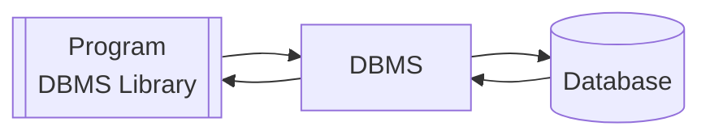
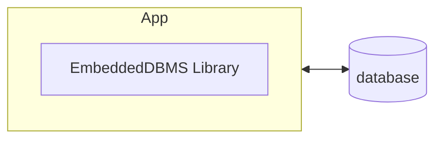

To connect a [[Databases|Database]] to a [[Java]] program you use a **DBMS** (*DataBase Management System*).

Some famous libraries to write to a *Relational DBMS* are **ODBC** or **ADO**.
Example Implementation:

The Embedded DBMS is an implementation that directly writes to the Database without any other process that is separate from the Application. It doesn't implement permission checking but it's lighter and simpler to install compared to a full separate DBMS.
These embedded DBMS usually use the *ODBC* standard implementation that usually return a touple of *key - value*.
## Steps to connect
1. Connecting to the database
2. Preparing the statements
3. Executing statements
4. End Connection
