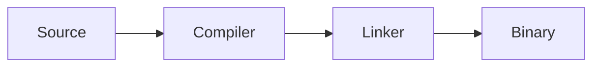
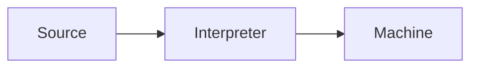
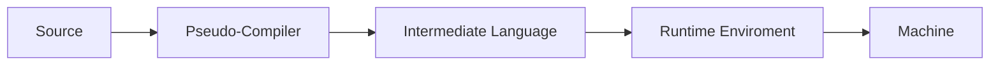

## Compilation

## Interpretation

## Bytecode

### Runtime Environment examples
- CLR => Common Language Runtime (C#, visual basic)
- JRE => Java Runtime Environment
- DVK => Dalvik Virtual enviroment
### Intermediate Language examples
- MSIL => MicroSoft Intermediate Language
- Bytecode (*.class*) => Java's Intermediate language
## JIT
Just In Time compilation
