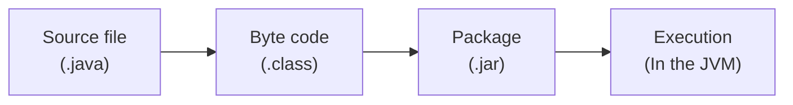

# Classes
```Java
<visibility> class Name {

	public Name(){} //constructor
}
```

Constructors are a special method that is a Class Method and you usually find two of them:
1. Default constructor (shown in example) with no parameters
2. Attribute constructor, that asks for every attribute when called to make an already filled attributes.
   ```java
   public Name(type param1, type param2) {
	   this.param1 = param1;
	   this.param2 = param2;
   }
```
# Visibility
## Public

## Private

## Protected

## Abstract

## Static-ness
When an attribute is static it's the same for all instances of the class, so it's a class attribute and not an object attribute.
Example of a `static` attribute:.
```Java
private static int counter = 42;
```
Methods can also be static in Java. This is because static attributes can only be used by class methods that are static, because they need to be callable even with no instance of that class. An example of a static method can be the main function or a constructor of a class.
``` Java
public static void main(String[] args) {}
```
To call a class method you can either use the class or an instance of it:.
```Java
MyClass.myMethod();
myInstanceOfClass.myMethod();
```
# Types in Java
## Making Constants
A constant in Java can be declared with the `final` keyword. Example:
```Java
public final int awnserToAllQuestions = 42;
```

# How it works
Java is a pseudocompiled language, that is compiled to bytecode that is then run on the Java Virtual Machine.


JDK (Javac, jar, debuigginh tools, javap)
JRE ()