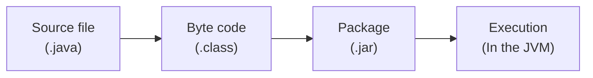

# Classes
```Java
<visibility> class Name {

	public Name(){} //constructor
}
```

Constructors are a special method that is a Class Method and you usually find two of them:
1. Default constructor (shown in example) with no parameters
2. Attribute constructor, that asks for every attribute when called to make an already filled attributes.
   ```java
   public Name(type param1, type param2) {
	   this.param1 = param1;
	   this.param2 = param2;
   }
```

## How it works
Java is a pseudocompiled language, that is compiled to bytecode that is then run on the Java Virtual Machine.

