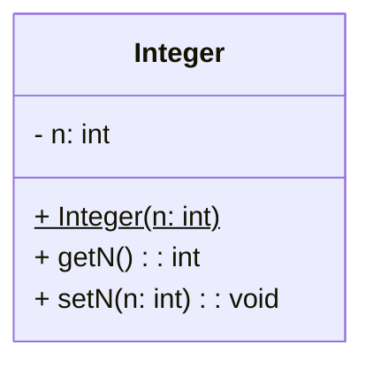
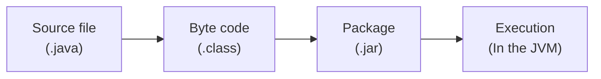

# Classes
```Java
<visibility> class Name {

	public Name(){} //constructor
}
```

Constructors are a special method that is a Class Method and you usually find two of them:
1. Default constructor (shown in example) with no parameters
2. Attribute constructor, that asks for every attribute when called to make an already filled attributes.
   ```java
   public Name(type param1, type param2) {
	   this.param1 = param1;
	   this.param2 = param2;
   }
```
Every class is the son of the mother class `Object`
# Visibility
## Public

## Private

## Protected

## Abstract

## Static-ness
When an attribute is static it's the same for all instances of the class, so it's a class attribute and not an object attribute.
Example of a `static` attribute:.
```Java
private static int counter = 42;
```
Methods can also be static in Java. This is because static attributes can only be used by class methods that are static, because they need to be callable even with no instance of that class. An example of a static method can be the main function or a constructor of a class.
``` Java
public static void main(String[] args) {}
```
To call a class method you can either use the class or an instance of it:.
```Java
MyClass.myMethod();
myInstanceOfClass.myMethod();
```
# Types in Java
## Making Constants
A constant in Java can be declared with the `final` keyword. Example:
```Java
public final int AwnserToAllQuestions = 42;
```
## Boxing
Boxing is when you take a primitive type and box it inside a class that only has the primitive type inside. Example:.

Java already offers all primitive types boxed inside classes.

# How it works
Java is a pseudocompiled language, that is compiled to bytecode that is then run on the Java Virtual Machine.


JDK (Javac, jar, debuigginh tools, javap)
JRE ()

# Java Runtime Environments
## JME
Java Micro Edition
## JSE
Java Standard Edition
## JEE
Java Enterprise Edition
Now JAKARTA project, it's open source under Apache because Oracle abandoned JEE.
## Oracle shenanigans
The most recent version as of the 18th of September 2023 is Java 19.
From Oracle's website two versions can be installed:
- JRE => Java Runtime Environment, no devtools or compilers are present.
- JDK => Everything you need to run and develop Java software
# Libraries In Java
Libraries in Java are inside *.jar* files, these are just ZIPs with a different extension. Because managing extensions is a mess, there are *xml* files that describe all the libraries needed that can be found online. A famous one of these utilities is **Maven**. 
# ArrayLists
An arraylist is a class in `java.util.ArrayList` that is dynamically resized to fit the contents.
To instantiate an ArrayList you need to import it and declare it as follows:.
```Java
visibility ArrayList<datatype> name = new ArrayList();
```
To add an element to the the ArrayList you can use the `.add()` method:
```Java
name.add(element);
```
and elements can then be removed by using the `.remove()` method:
```Java
name.remove(index);
```
and to access an element from the list you use the `.get()` method:.
```Java
name.get(index);
```
More methods are available:
```Java
name.size();
```
Returns the size of the array
```Java
name.indexOf(element);
```
Searches `element` in `name` and returns the index, if not found it returns -1.

# Enumeration
In Java enumerations are in a special class of name `enum`:.
```Java
public enum PokemonFamily{
	FIRE,
	WATER,
	PLANT,
	...
	STONE
}
```
To reference this enumeration you just use it as a class:.
```Java
PokemonFamily pf = PokemonFamily.FIRE;
```
Each `enum` has a method called `.values()` that returns each and every value of the enumeration and another method called `.valueOf(String)` that takes a `String` and returns the type in the enumeration of that if present in the Enumeration. There also is the `.compareTo(EnumName)` that returns an integer that compares the Enumeration given to the current enumeration in `this`.

# Inheritance
