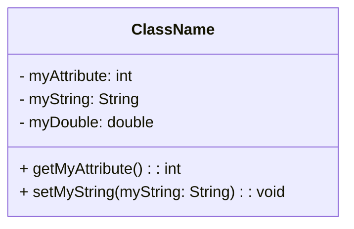

# Objects
Objects are like "boxes" that contain **methods** and **attributes**, which are equivalent to functions and variables. These are accessible only through the object and are invisible to the outside if they aren't accessed through accessor methods or from the class if public.
Methods are usually **instance methods**, this means that they can **only** be accessed if the class has been instantiated in the code, if it hasn't been instantiated yet you wont be able to use those methods. Constructors are not normal instance methods but they are **class methods** and can be accessed even if a class hasn't been instantiated.

Objects are always pointer, or better yet, they're **handles**, which are pointers to that object.
## Information hiding
In Object Oriented Programming each and every class can be hidden and not be visible by the end user of the class-library and only use the methods that are publicly accessible from the outside. Nothing about the implementation will be visible from the outside.
## Classes structure
Every class must contain a constructor to instantiate it, but this might vary depending on the language and the implementation of the class. Furthermore it sometimes has a visibility, for example in [[Java]] it can be [[Java#Visibility||public, private, abstract or protected]]. 
Classes can also be represented with an [[The UML Diagram||UML diagram]] to show the working of the class as follows:.

# Example OOP languages
- [[Java]]
- [[Kotlin]]
- [[C++]]

[^1]: [[Object Oriented Programming common practices|Common practices in object oriented programming.]] 