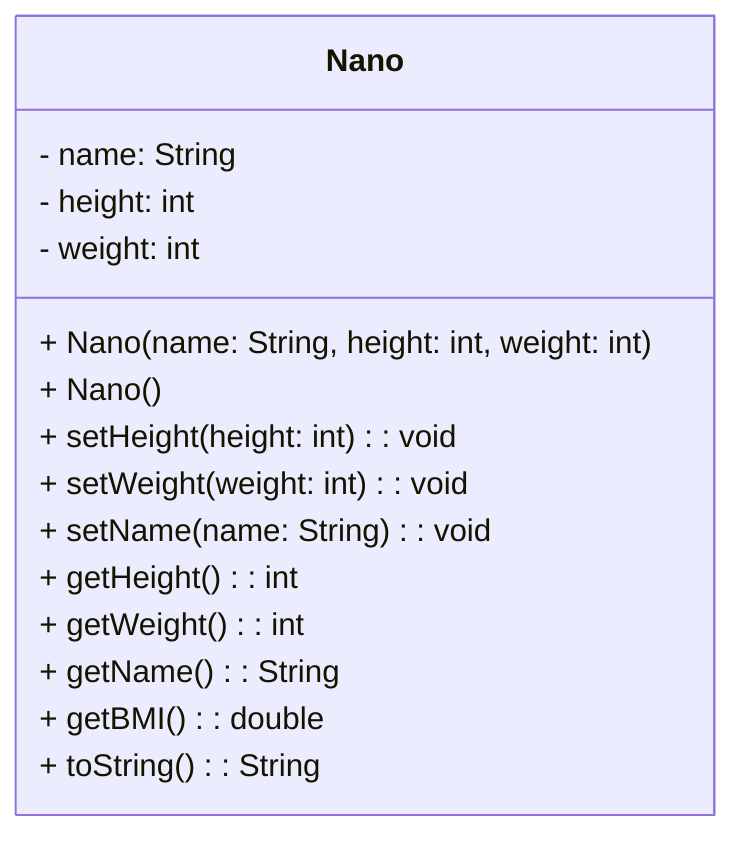

# Objects
Objects are like "boxes" that contain **methods** and **attributes**, which are equivalent to functions and variables. These are accessible only through the object and are invisible to the outside if they aren't accessed through accessor methods or from the class if public.
Methods are usually **instance methods**, this means that they can **only** be accessed if the class has been instantiated in the code, if it hasn't been instantiated yet you wont be able to use those methods. Constructors are not normal instance methods but they are **class methods** and can be accessed even if a class hasn't been instantiated.
## Information hiding
In Object Oriented Programming each and every class can be hidden and not be visible by the end user of the class-library and only use the methods that are publicly accessible from the outside. Nothing about the implementation will be visible from the outside.
## The UML diagram
The UML Diagram, or **Unified Modelling Language**, represents one or more classes and their relation. [^1]
An example UML diagram can be seen here:.

The first element on the top is the Class name, followed by the attributes and finally by the accessor accompanied by each parameter and relative types of returns and parameters.
Furthermore, in front of each method and attribute, there is a "+" or "-" sign. The *plus* declares the method or attribute as public, while the *minus* declares it as private.
The constructor can be also not defined inside the UML Diagram, the same applies to the getty and setty methods.
# Example OOP languages
- [[Java]]
- [[Kotlin]]
- [[C++]]

[^1]: [[Object Oriented Programming common practices|Common practices in object oriented programming.]] 