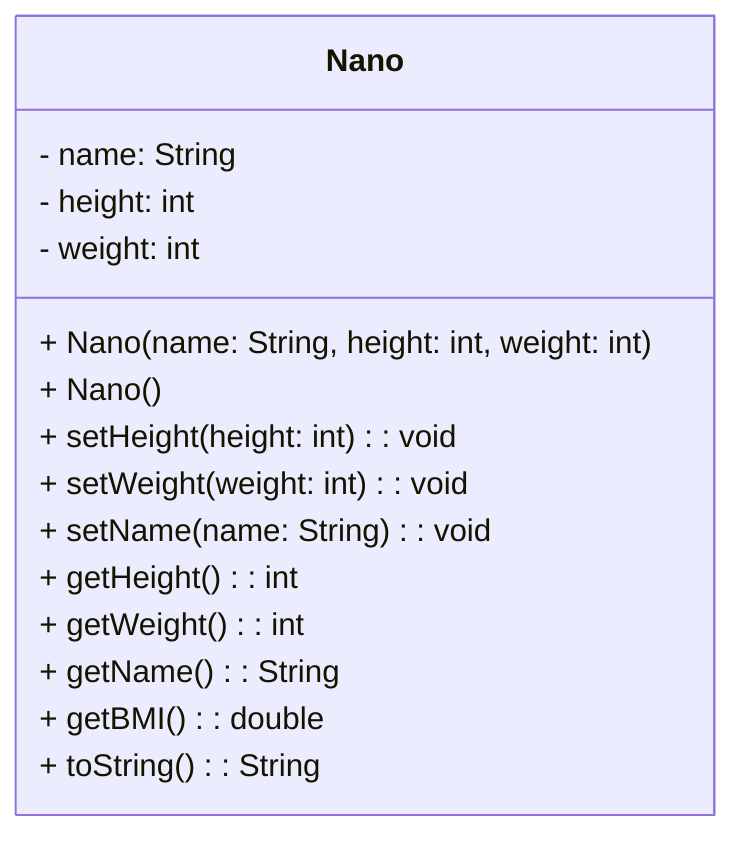
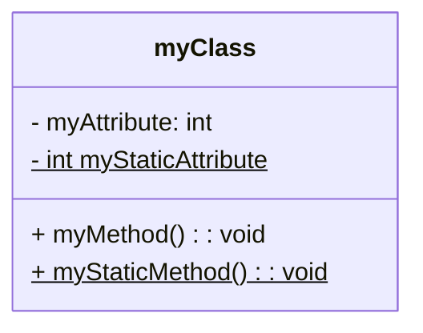

# The UML Diagram
The UML Diagram, or **Unified Modelling Language**, represents one or more classes and their relation. [^1]
An example UML diagram can be seen here:.

The first element on the top is the Class name, followed by the attributes and finally by the accessor accompanied by each parameter and relative types of returns and parameters.
Furthermore, in front of each method and attribute, there is a "+" or "-" sign. The *plus* declares the method or attribute as public, while the *minus* declares it as private.
The constructor can be also not defined inside the UML Diagram, the same applies to the getty and setty methods.
Static methods or attributes are marked by being underlined:.

[^1]: [[Object Oriented Programming common practices|Common practices in object oriented programming.]] 