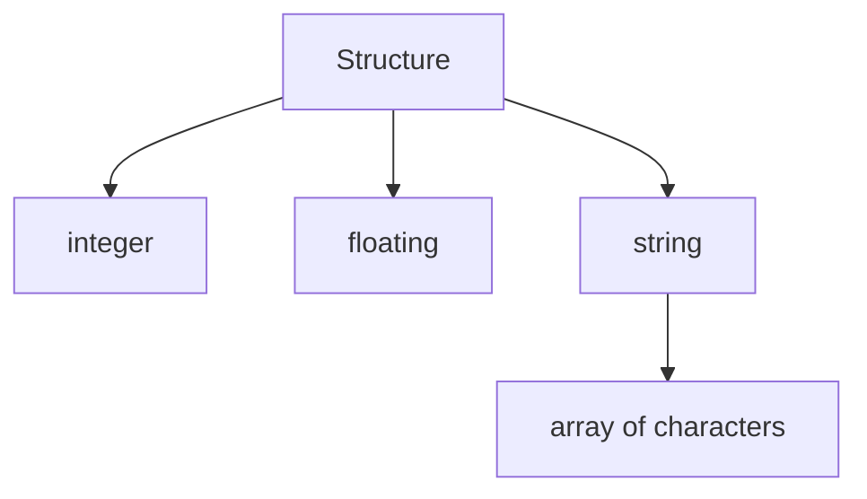

### Struct with three primitives
```c
typedef struct{
	int integer;
	char* string;
	float floating;
}Structure;
```

**Memory diagram**

### Accessors functions of struct
```C
int getInteger(Structure s){
	return s.id;
}

void setString(Structure*s, char*str){
	if(!s) return;
	if(s->string) free(s->string);
	s->string = strdup(str);
}
```

### Struct with nested struct
```C
typedef struct{
	int integer
}Date;

typedef struct{
	Date* deathDate;
	Date birthDate;
	char* name;
}Tombstone;
```

When a structure has multiple nested structures that are needed for the definition they're defined as **composed**. Those structures that aren't needed are defined as **aggregations**. [^1]
### Getty and Setty for nested structs
```C
Date getDeathDate(Tombstone t){
	if(t.deathDate) return copyDate(t.deathDate);
	return NULL;
}

Date getBirthDate(Tombstone t){
	return t.birthDate;
}

void setDeathDate(Tombstone*t, Date* newDeathDate){
	if(!t) return;
	if(t->deathDate) dateDisposer(t->deathDate);
	t->deathDate = copyDate(newDeathDate);
}

void setBirthDate(Tombstone*t, Date* newBirthDate){
	if(!t) return;
	t->birthDate = *newBirthDate;
}
```


[^1]: View the relative note [[IT/Nesting Structures|nesting structures]]
