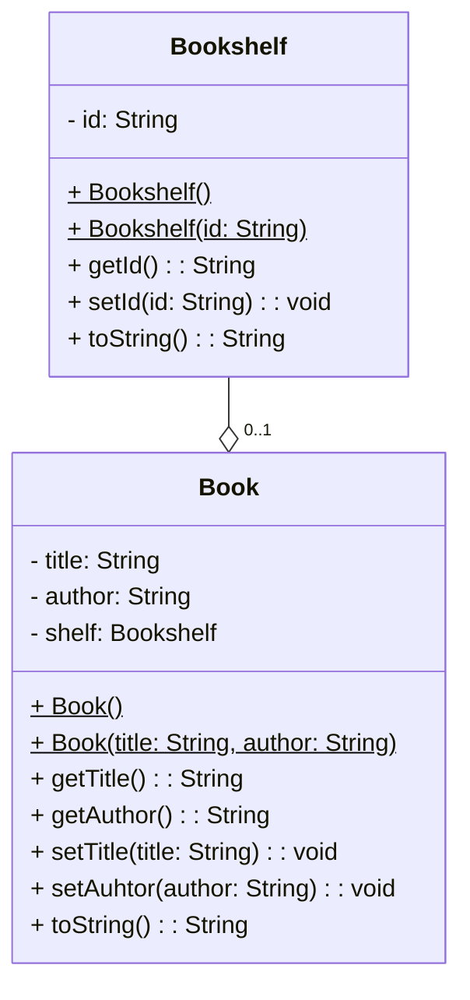
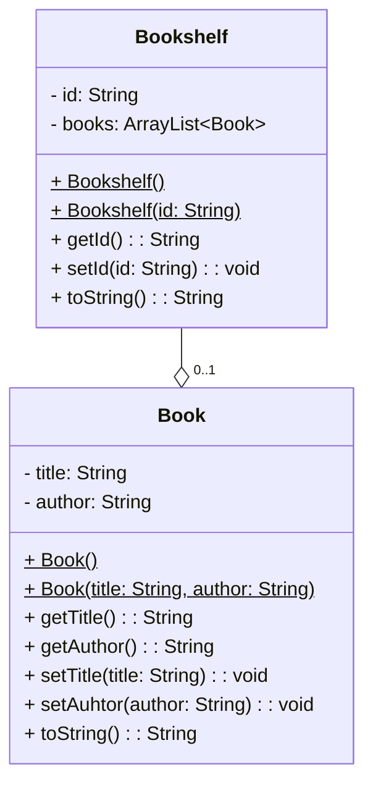

# Aggregation, book contains the shelf its in

```mermaid
classDiagram

class Book{
	- title: String
	- author: String
	- shelf: Bookshelf
	+ Book()$
	+ Book(title: String, author: String)$
	+ getTitle(): String
	+ getAuthor(): String
	+ setTitle(title: String): void
	+ setAuhtor(author: String): void
	+ toString(): String
}

class Bookshelf{
	- id: String
	+ Bookshelf()$
	+ Bookshelf(id: String)$
	+ getId(): String
	+ setId(id: String): void
	+ toString(): String
}

Bookshelf --o "0..1" Book

```
# Aggregation, shelf contains books

```mermaid
classDiagram

class Book{
	- title: String
	- author: String
	+ Book()$
	+ Book(title: String, author: String)$
	+ getTitle(): String
	+ getAuthor(): String
	+ setTitle(title: String): void
	+ setAuhtor(author: String): void
	+ toString(): String
}

class Bookshelf{
	- id: String
	- books: ArrayList~Book~
	+ Bookshelf()$
	+ Bookshelf(id: String)$
	+ getId(): String
	+ setId(id: String): void
	+ toString(): String
}

Bookshelf --o "0..1" Book

```