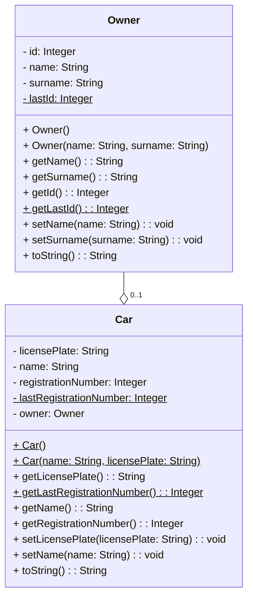
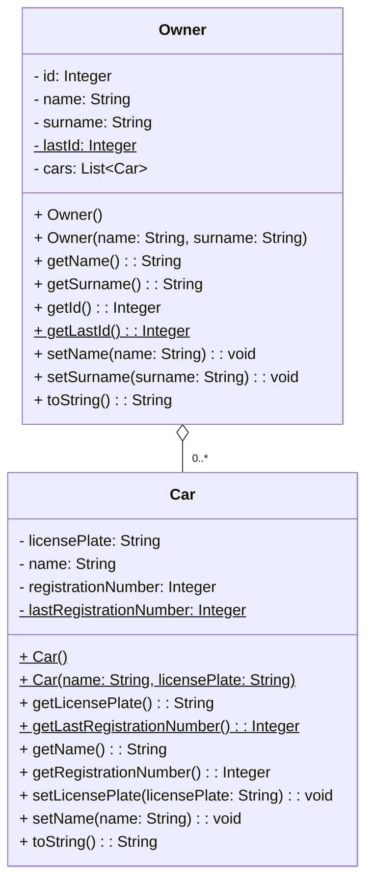

```mermaid
classDiagram
class Car{
	- licensePlate: String
	- name: String
	- registrationNumber: Integer
	- lastRegistrationNumber: Integer$
	- owner: Owner
	+ Car()$
	+ Car(name: String, licensePlate: String)$
	+ getLicensePlate(): String
	+ getLastRegistrationNumber(): Integer$
	+ getName(): String
	+ getRegistrationNumber(): Integer
	+ setLicensePlate(licensePlate: String): void
	+ setName(name: String): void
	+ toString(): String
}

class Owner{
	- id: Integer
	- name: String
	- surname: String
	- lastId: Integer$
	+ Owner()
	+ Owner(name: String, surname: String)
	+ getName(): String
	+ getSurname(): String
	+ getId(): Integer
	+ getLastId(): Integer$
	+ setName(name: String): void
	+ setSurname(surname: String): void
	+ toString(): String
}

Owner --o "0..1" Car
```

If the Owner instead had the car:

```mermaid
classDiagram
class Car{
	- licensePlate: String
	- name: String
	- registrationNumber: Integer
	- lastRegistrationNumber: Integer$
	+ Car()$
	+ Car(name: String, licensePlate: String)$
	+ getLicensePlate(): String
	+ getLastRegistrationNumber(): Integer$
	+ getName(): String
	+ getRegistrationNumber(): Integer
	+ setLicensePlate(licensePlate: String): void
	+ setName(name: String): void
	+ toString(): String
}

class Owner{
	- id: Integer
	- name: String
	- surname: String
	- lastId: Integer$
	- cars: List~Car~


	+ Owner()
	+ Owner(name: String, surname: String)
	+ getName(): String
	+ getSurname(): String
	+ getId(): Integer
	+ getLastId(): Integer$
	+ setName(name: String): void
	+ setSurname(surname: String): void
	+ toString(): String
}

Owner o-- "0..*" Car
```
