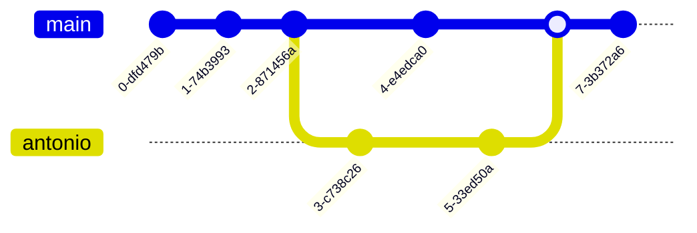

> [!INFO] Info block
> test

> [!WARNING] Warning block
> test

> [!ERROR] ERROR block
> test

> [!NOTE] Note block
> test

> [!BUG] Bug block
> test

> [!EXAMPLE] Example block
> Gianni

> [!QUOTE] Quote block
> test

> [!HELP] Help block
> test

> [!DONE] Done block
> test

> [!HINT] Hint block
> test

> [!TODO] Todo block
> test

> [!TLDR] TLDR block
> test

> [!INFO]- Collapsable info block
> More text
> So much text
> All hidden
> Thanks to the cool as fuck Obsidian Markdown Extensions

