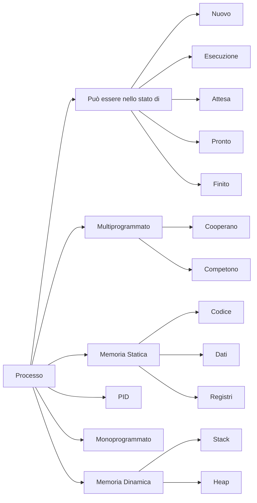
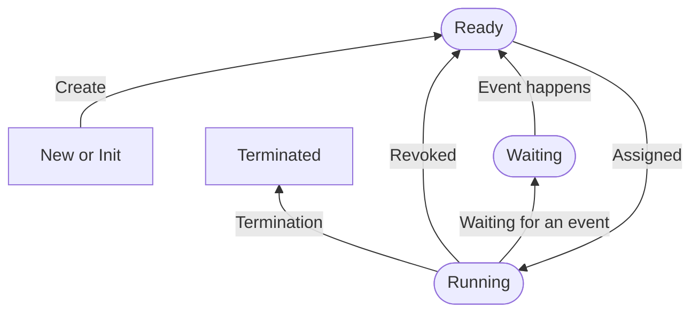

```mermaid
flowchart LR

A[Processo]
B[Memoria Statica]
C[Memoria Dinamica]
D[Può essere nello stato di]

A --> D

D --> Nuovo
D --> Esecuzione
D --> Attesa
D --> Pronto
D --> Finito

A --> PID

A --> Monoprogrammato
A --> Multiprogrammato
Multiprogrammato --> Cooperano
Multiprogrammato --> Competono
A --> B
A --> C

B --> Codice
B --> Dati
B --> Registri

C --> Stack
C --> Heap

```
## Status diagram for a process

```mermaid
flowchart BT

A([Running])
B[New or Init]
C[Terminated]
D([Waiting])
E([Ready])

B -->|Create| E
E -->|Assigned| A
A -->|Revoked| E
A -->|Waiting for an event| D
D -->|Event happens| E
A -->|Termination| C

```

