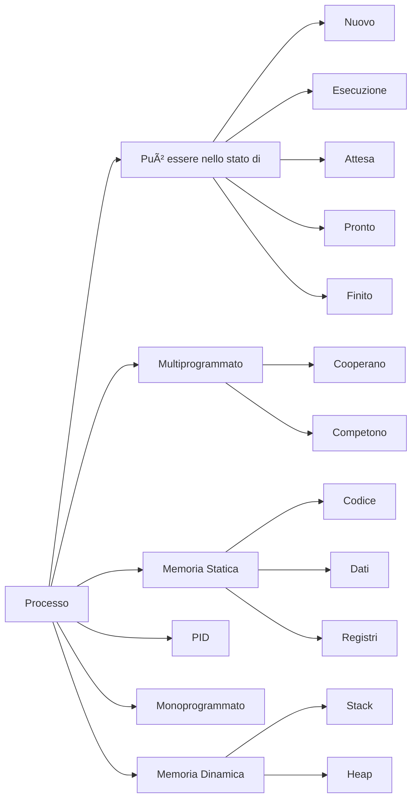

## Status diagram for a process

## Suspension by Interrupt
The **Task Scheduler** interrupts a process when it has reached its *time slice* and puts it into the **Ready** status. Interrupts can also happen because of Input/Output devices sending interrupt signals. Hardware interrupts are not made by the **Scheduler** but by actual hardware.
## Context Switching
When the *scheduler* interrupts a process, it makes a **snapshot** of all the details be them CPU registers, memory areas, files and remaining time on the processes slice and replaces them with another processes snapshot. This is called **Context Switching**.
## Process Control Block
The Process Control Block (abbreviated as *PCB*) contains all the information about a process such as the **PID**, the status of that process, the CPU Program Counter, the other CPU registers (IR, SP, etc), the process priority, file pointers, the memory limit assigned and more. These tables are contained inside the **Process Table** that is managed by the task scheduler.

INIT is the first process, all other proceses are its child