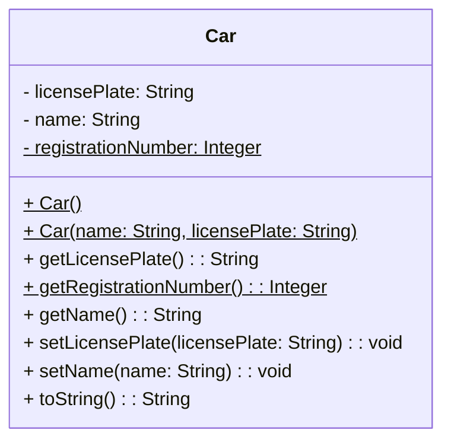

```mermaid
classDiagram
class Car{
	- licensePlate: String
	- name: String
	- registrationNumber: Integer$
	+ Car()$
	+ Car(name: String, licensePlate: String)$
	+ getLicensePlate(): String
	+ getRegistrationNumber(): Integer$
	+ getName(): String
	+ setLicensePlate(licensePlate: String): void
	+ setName(name: String): void
	+ toString(): String
}
```
